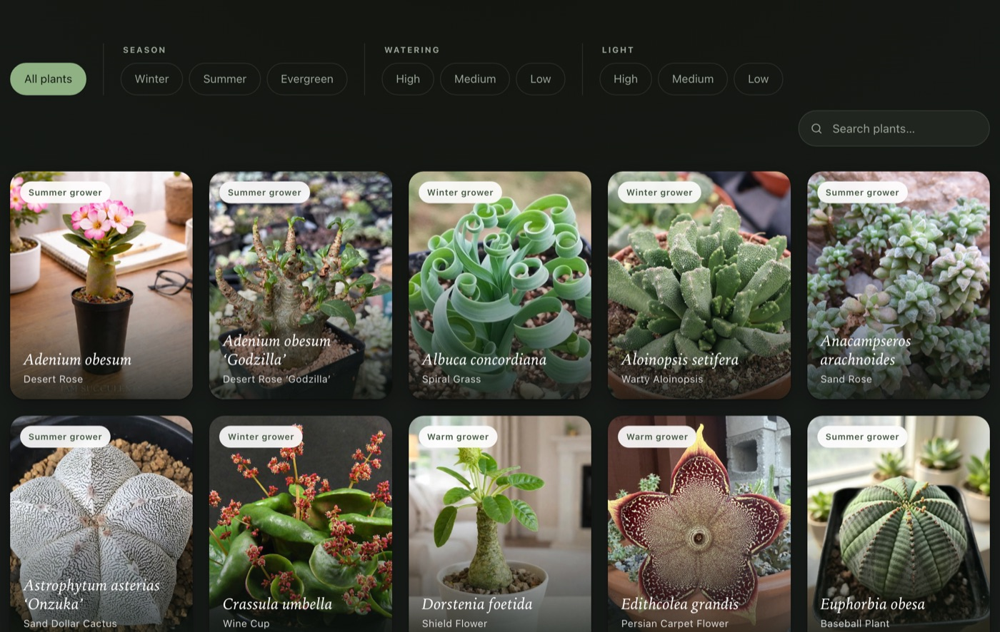

# 🌵 Succulents &amp; Caudex

A small, elegant single-page web app cataloguing an indoor collection of oddball
succulents, caudiciforms, cacti and mesembs — each with a care sheet written for
one specific growing setup.



## Features

- **23 plants**, each a real photo card with its Latin and common name.
- Tap any plant for a full care sheet — **sunlight, watering, dormancy &amp; cycle,
  soil / mix, feeding, and watch-outs.**
- Filter by **Season**, **Watering** need, and **Light** need — the facets combine.
- Live **search** — start typing anywhere and it matches Latin name, common name,
  family or habit.
- Uniform, responsive grid; light &amp; dark theme aware.
- **Zero dependencies, no build step** — one `index.html` plus local images.

## Growing conditions assumed

Every care note is tuned to one environment:

> **Bonsai Jack 1:1:1 Gritty Mix** · LED grow lights · good airflow ·
> a steady **68–73 °F** · **30–50% humidity**, year-round.

Because temperatures are stable, dormancy advice leans on the plant's own cues
(leaf drop, closed rosettes) and day length rather than the calendar. Treat it all
as a starting point — read the plant, not the clock.

## Usage

No server or build required. Just open the file:

```sh
open index.html
```

Deep-link straight to a plant with a URL hash, e.g. `index.html#lithops`.

## Photos

Plant photographs are from [iNaturalist](https://www.inaturalist.org) contributors
under Creative Commons licenses. Per-image attribution and license are recorded in
[`images/credits.json`](images/credits.json).

## Note

A personal project — not intended for production.
